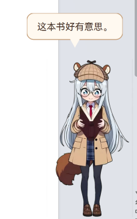
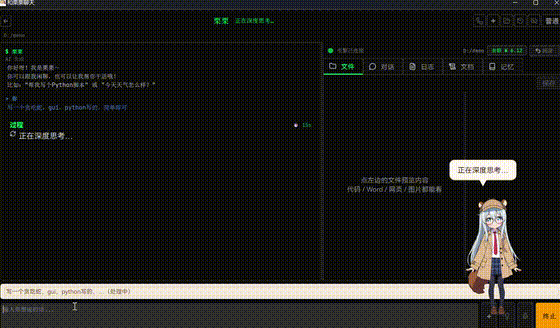
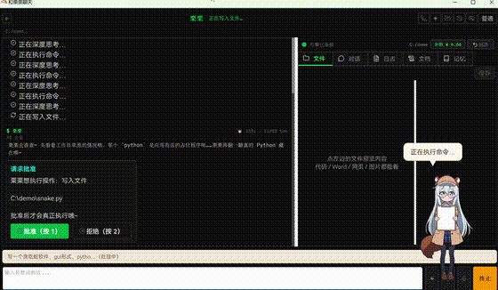
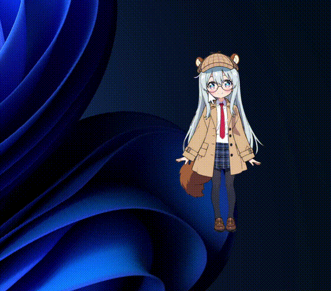

# 栗栗 (Tamias) — Squirrel Detective · AI Agent Desktop Pet

> [中文版](README.zh.md)

<p align="center">
  
</p>

<p align="center">
  
</p>

> ⚠️ **Current status: MVP (early stage), not yet 1.0**: due to time and resource constraints,
> this product has **not been thoroughly tested** and may contain functional defects, stability,
> or compatibility issues — do not use it in critical/production scenarios.
> If you find significant problems, please report them via [GitHub Issues](https://github.com/yuanqubeiding/tamias/issues).

> An AI Agent desktop pet — your desktop AI butler for Windows: chats with you and does real work for you
> (reads files, writes code, edits files), and rolls back mistakes in one click.
> 栗栗 is a squirrel detective in a plaid trench coat and deerstalker hat, with the
> temperament of a "clear-eyed college student".

## What 栗栗 can do

<p align="center">
  
</p>

- **Casual chat**: powered by the DeepSeek API (streaming replies, memory, four languages)
- **Real work**: let 栗栗 read files, search, write code, edit files (via the dsh engine, step-by-step visualized)
- **Approval gate**: every system action requires your approval; tool names are translated into plain language, raw commands are collapsible
- **Work rollback**: a snapshot is taken before any change; one click restores exactly (side-by-side diff + one-click undo)
- **Handy tools**: weather, Pomodoro timer, random decision, unit conversion, timed reminders
- **Voice input**: hold-to-talk speech-to-text via Windows local offline recognition; audio is never uploaded
- **Sprite animations**: 19 groups of animated reactions (yawn, poke, reading, thinking, …) plus a "spirit value" that gets sleepy late at night

<p align="center">
   
</p>

### See it in action

**Real work** — 栗栗 writes a Snake game:

<p align="center"></p>

**Approval gate** — every system action needs your OK:

<p align="center"></p>

**Being cute** — poke and pet it:

<p align="center"></p>

## Tech stack

- **Python 3.14** / **PySide6** (LGPL, closed-source-friendly)
- **DeepSeek API**: chat channel (deepseek-chat)
- **dsh (DeepSeek Harness)**: work engine (Node.js runtime, self-started with the app)
- **Live2D**: desktop-pet rendering (Cubism Core + PixiJS)
- Packaging: PyInstaller (onedir) → Inno Setup

## Quick start (development)

```bash
pip install -r requirements.txt
python tamias/main.py
```

## License & copyright

The **code** in this repository is licensed under [Apache License 2.0](LICENSE) (open source).
**Illustrations, animations, icons, persona and other assets** retain their copyright and are NOT licensed under Apache-2.0 — see [Asset License](ASSETS_LICENSE.md).

Integrated third-party components are used under their own licenses — see [NOTICE.txt](NOTICE.txt):

Fonts (HarmonyOS Sans SC / Noto Sans JP / JetBrains Mono), Node.js, dsh,
PySide6 / Qt (LGPL-3.0), Live2D Cubism Core (proprietary), pixi-live2d-display and
PixiJS (MIT), Lucide icons (ISC), and others.

## Acknowledgements

Some of 栗栗's interaction designs reference established paradigms from excellent developer tools:

- **Claude Code**: busy-time queueing, inline approvals, work rollback (file-history), memory index
- **Visual Studio Code**: presentation of the work-process list (read file / search / think / edit)

Thanks to the teams behind these tools for saving us from many design pitfalls.

## Contributing

Contributions are welcome! Bug reports, feature suggestions, and pull requests are all appreciated.

- Bugs / suggestions: open an [issue](https://github.com/yuanqubeiding/tamias/issues) with the right template
- Code / docs / translations: see [CONTRIBUTING](CONTRIBUTING.md)

> Note: illustrations, animations, icons and the persona are copyright-reserved assets, not open-sourced under Apache-2.0 — see [Asset License](ASSETS_LICENSE.md).

## Author

© 2026 栗栗 (Tamias) author

- GitHub: github.com/yuanqubeiding
- Feedback: GitHub Issues

---

**Keywords**: AI desktop pet · AI Agent · desktop AI butler · desktop pet · virtual pet · chatbot · DeepSeek · open source · Windows
